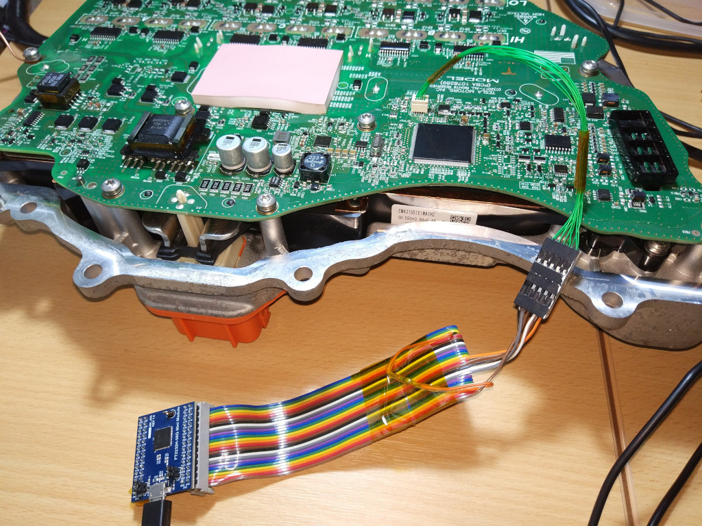

# Tesla M3 inverter JTAG cable

It is possible to erase, reprogram and debug software running on a Tesla Model 3 / Y drive unit inverter using a simple JTAG adapter. No additional  hardware, software or knowledge is required beyond TI Code Composer Studio and a JTAG adapter. Erasing the flash on the device will remove code protection applied by Tesla allowing the device to be re-used.

**Disclaimer: Building and using a JTAG adapter as described here can wipe existing firmware from your Tesla inverter rendering it completely non-functional. Doing this is at your own risk.**

## Off The Shelf Solution

An easy to use JTAG adapter specifically designed to fit the Tesla M3 inverter has been built by Damien Maguire. This can be purchased from his [shop](https://www.evbmw.com/index.php/evbmw-webshop/tesla-boards/m3du-jtag).

## DIY adapter

A simple adapter can be made with an [FTDI FT2232H-56Q MINI MODULE](https://ftdichip.com/products/ft2232h-56-mini-module/), a Hirose DF20A-10DS-1C connector shell, Hirose DF20F-2830SCFA connector pins and some 30 AWG wire-wrap wire. **The crimps pins are incredibly small and fiddly to assemble.**

FTDI FT2232H | Pin   | Tesla JTAG | Pin
-------------|-------|------------|----
ADBUS0       |CN2-8  | TCK        | 9
ADBUS1       |CN2-9  | TDI        | 3
ADBUS4       |CN2-13 | /TRST      | 1
ADBUS2       |CN2-10 | TDO        | 10
ADBUS3       |CN2-11 | TMS        | 4
GND          |CN2-1  | GND        | 5

Also connect ACBUS5 (CN2-23) to GND (CN2-3) with a 1K resistor. Failure to do this will mean that Code Composer Studio will fail to connect to the target device.

The full JTAG pinout is available: <https://github.com/damienmaguire/Tesla-Model-3-Drive-Unit/blob/master/M3_TMS_JTAG_Pinout.pdf>

Once assembled the FTDI FT2232H must be programmed with the correct USB identifiers and configuration so that it appears to the host PC as a TI XDS100v2 JTAG adapter. To do this use the Windows [FT_PROG](https://ftdichip.com/utilities/#ft_prog) to apply the [TI template](https://software-dl.ti.com/ccs/esd/documents/xdsdebugprobes/files/F28379D_LAUNCHXL.zip).
